# pgx-digest

[](https://github.com/foertsch/pgx-digest/actions/workflows/ci.yml)
[](LICENSE)

> Privacy-first pharmacogenomic narrative reports with a typed Verifier that catches LLM hallucinations before they leave the pipeline.

The LLM cannot invent a variant, a drug, a metabolizer phenotype, or a citation — every claim on every card is traced back to the source PharmCAT Bundle, and Verifier failures reject the draft.

---

## Architecture

> 💡 Hover any node for a one-line summary. Click any node to jump to its component description below.
> For a **zoomable, pannable, click-for-details version of this diagram**, open the
> [**interactive architecture explorer →**](https://foertsch.github.io/pgx-digest/)

```mermaid
flowchart LR
  Input[/"PharmCAT JSON"/]
  Bundle["Bundle&lt;PGxFinding&gt;"]
  Ranker[Ranker]
  Triage[Triage]
  Drafter["LLM Drafter"]
  Verifier[Verifier]
  Report(["verified report"])

  Input --> Bundle
  Bundle --> Ranker
  Ranker --> Triage
  Triage --> Drafter
  Drafter --> Verifier
  Verifier --> Report

  CPIC[("CPIC corpus")] -.RAG.-> Drafter
  PubMed[("PubMed abstracts")] -.RAG.-> Verifier

  click Input "#pharmcat-json" "Upstream PharmCAT v3 (Docker) emits per-gene diplotype calls + CPIC drug recommendations + cited PMIDs"
  click Bundle "#bundle" "Typed, immutable, generic data structure carrying privacy_tier metadata for LLM redaction"
  click Ranker "#ranker" "Pure deterministic ordering by clinical impact (PM > UM > IM > RM > Normal)"
  click Triage "#triage" "Routes each (gene, drug, rec) tuple to llm / template / skip. ML alternative evaluated in Ablation E and rejected: 98.7% agreement but edge-case regression."
  click Drafter "#llm-drafter" "Fenced LLM (Anthropic + Gemini providers). JSON-schema-constrained output. Batch and per-card modes. Bundle redaction strips chromosomal coordinates before the call."
  click Verifier "#verifier" "Typed field checks + cross-gene prose check + PubMed cosine grounding. NLI alternative evaluated in Ablation H and rejected (AUROC 0.355, anti-correlated with gold)."
  click Report "#verified-report" "Per-field verified badges; failed checks reject the draft and (in production) trigger a retry"
  click CPIC "#cpic-corpus" "Authoritative CPIC guidelines fetched from api.cpicpgx.org PostgREST endpoint"
  click PubMed "#pubmed-abstracts" "NCBI eutils-fetched abstracts, cached locally for citation grounding"

  classDef deterministic fill:#1B1B28,stroke:#A78BFA,stroke-width:1.5px,color:#E5E7EB
  classDef llmnode      fill:#1B1B28,stroke:#A78BFA,stroke-width:1.5px,color:#E5E7EB
  classDef destination  fill:#D97757,stroke:#D97757,stroke-width:2px,color:#0A0A14
  classDef corpus       fill:#13131D,stroke:#9CA3AF,stroke-width:1.2px,color:#9CA3AF

  class Input,Bundle,Ranker,Triage,Verifier deterministic
  class Drafter llmnode
  class Report destination
  class CPIC,PubMed corpus
```



---

## What this demonstrates

An **AI Product Engineering** portfolio piece showing LLM-systems architecture rather than LLM-as-magic. Specifically:

- **Deterministic core, fenced LLM, typed Verifier.** Diplotype calls and CPIC recommendations come from PharmCAT (deterministic). The LLM's only job is narrative synthesis. Every claim is verified.
- **Empirical rigor with honest negative results.** Two pieces of ML were evaluated and rejected on principled grounds — both findings are documented and shipped as part of the eval framework. (See [Empirical findings](#empirical-findings) below.)
- **Privacy-first by construction.** `Bundle` carries a `privacy_tier` flag; redaction strips chromosomal coordinates before any LLM call. Public demo data goes to the cloud; real personal genome data stays local.
- **Real-world eval surface.** 65 real 1000 Genomes samples (NYGC 30x release) span 5 superpopulations × 24 subpopulations. Population frequencies for CYP2C19, CYP3A5, ABCG2 match published CPIC values. See [`tests/fixtures/1kg_quality_report.md`](tests/fixtures/1kg_quality_report.md).

---

## Empirical findings

Seven systematic ablations + one supplementary. The two ML ablations both produced **negative results** — they're the most informative pieces of empirical work in the repo because they show the rigor to detect when an approach doesn't work.

| Ablation | Question | Outcome |
|---|---|---|
| **A** — Verifier on/off | Catches LLM hallucinations? (controlled via `AdversarialDrafter`) | **100% catch rate** across swap_pmid, swap_drug, swap_phenotype, swap_diplotype; 0% false-positive on faithful baseline |
| **B** — Model comparison | Same inputs across Haiku/Sonnet/Gemini | All three pass typed verification; judge means in 3.1–3.4 (±0.2 noise band); Sonnet ~2× slower than Haiku for marginal quality |
| **C** — Ranker variant | Deterministic vs LLM ordering | LLM ranker places actionable IM cases before Normals; deterministic is alphabetical fallback |
| **D** — Triage on/off | Token-cost reduction via template routing | **−27% Drafter input tokens** on multi-gene fixture, no judge regression |
| **E** — Batch vs per-card mode | Failure modes on real PharmCAT fixtures (up to 73 cards) | Batch silently drops 5–25% on large bundles; per-card mode catches each missing pair via the Verifier, 2.2× faster wall-clock with `ThreadPoolExecutor` |
| **F** — Rule-based vs learned Triage | Does ML add value to the routing layer? | **98.7% agreement** on 225 unique routing decisions. Marginal cost savings (−3 LLM calls / 225) outweighed by a safety-relevant regression on RYR1 × succinylcholine. **Rules ship; ML rejected.** |
| **G** — RAG on/off | CPIC guideline text in prompt + PubMed grounding in Verifier | Citations move from "the PMID integer is in the Bundle" to "the prose is semantically supported by what the cited abstract says" |
| **H** — Cosine vs learned NLI grounding | Does PubMedBERT-MNLI-MedNLI beat cosine for claim-citation grounding? | **NLI is anti-correlated with gold labels (AUROC 0.355).** Pre-trained NLI does strict logical entailment; clinical citation grounding needs implicit inference that small specialized models can't do. **Cosine baseline stays; LLM-as-judge identified as the right next architecture.** See [`eval_results/ablation_h_cosine_vs_nli.md`](eval_results/ablation_h_cosine_vs_nli.md). |

---

## Components

### <a id="pharmcat-json"></a>PharmCAT JSON

Upstream input from [PharmCAT v3](https://pharmcat.org/) (Stanford/Penn). Docker image `pgkb/pharmcat` takes a VCF and emits a `*.report.json` describing every called diplotype, every CPIC-actionable drug recommendation, and the cited PMID list per recommendation. pgx-digest wraps this in [`pharmcat_runner.py`](pgx_digest/pharmcat_runner.py) and parses the JSON output in [`pharmcat.py`](pgx_digest/pharmcat.py).

### <a id="bundle"></a>Bundle⟨PGxFinding⟩

The immutable, generic, typed data structure that flows through every stage. Carries a `privacy_tier` field — when set to `redacted`, `source_variants` are stripped before the LLM sees the Bundle, so the Drafter never gets raw chromosomal coordinates. Generic `Bundle<T>` lets us re-type as `Bundle<RankedFinding>` etc. Source: [`pgx_digest/bundle.py`](pgx_digest/bundle.py).

### <a id="ranker"></a>Ranker

Deterministic ordering by clinical impact so the LLM sees the high-stakes cards first. Sorts on phenotype severity (PM > UM > IM > RM > Deficient > Normal), then on actionable drug count, then alphabetical (stable tie-break). Pure function, fully unit-tested. Source: [`pgx_digest/ranker.py`](pgx_digest/ranker.py).

### <a id="triage"></a>Triage

Routes each `(gene, drug, recommendation)` tuple to one of three handlers:

- **`llm`** — needs narrative synthesis, sent to the LLM Drafter
- **`template`** — fits a small structured template, no LLM call
- **`skip`** — no actionable info worth surfacing

A learned-embedding variant ([`triage_ml.py`](pgx_digest/triage_ml.py), fastembed BGE-small + sklearn LogisticRegression) was evaluated against the rule-based version on 225 unique routing decisions across 69 fixtures. **Result: 98.7% agreement.** The learned model saved 3 LLM calls but introduced a safety-relevant regression on a rare RYR1 × succinylcholine case (routed to `skip` instead of `llm`). Decision: **rules ship**; ML was not justified at the cost of edge-case regression. The negative result is documented because that's the contribution.

### <a id="llm-drafter"></a>LLM Drafter

The only LLM call in the pipeline. JSON-schema-constrained output via per-provider enforcement. Source: [`pgx_digest/drafter.py`](pgx_digest/drafter.py).

- **Provider abstraction**: `AnthropicProvider` (Haiku 4.5 default), `GeminiProvider` (2.5-flash, free tier). `Provider` ABC means new backends are a one-class change.
- **Two modes**: `batch` (one call per bundle, fast for ~24 cards) and `per_card` (one call per (gene, drug) pair, robust to large bundles like 1000G fixtures producing 50–70 cards, parallelized with `ThreadPoolExecutor`).
- **Privacy**: Bundle redaction strips `source_variants` before the call. LLM sees phenotypes and drug names, never variant positions.
- **RAG**: CPIC guideline text is retrieved per-gene and added to the prompt; the LLM doesn't synthesize from training data alone.

### <a id="verifier"></a>Verifier

Catches LLM hallucinations before the report leaves the pipeline. Failed checks reject the draft (in production, retry). Source: [`pgx_digest/verifier.py`](pgx_digest/verifier.py).

- **Typed field checks** — every `(gene, diplotype, phenotype, drug)` in the draft must trace back to the source `Bundle`. Mismatches → failed.
- **Cross-gene prose check** — `recommendation` text is scanned for mentions of genes not in the source bundle. Catches the "LLM started talking about CYP2D6 even though we only had CYP2C19" failure.
- **PubMed citation grounding** — cited PMIDs are checked for semantic consistency with the prose claim via cosine similarity over BGE-small embeddings (threshold 0.35).
- **Ablation H — NLI grounding tried, rejected.** [`pritamdeka/PubMedBERT-MNLI-MedNLI`](https://huggingface.co/pritamdeka/PubMedBERT-MNLI-MedNLI) was evaluated as a learned alternative on 766 (claim, abstract, gold-score) triples. AUROC 0.355 (anti-correlated with gold). Diagnosis: pre-trained NLI does strict logical entailment; clinical citation grounding requires implicit inference. A 110M-param specialized model can't bridge that; an LLM can. LLM-as-judge identified as the right next architecture. Module ships in [`verifier_nli.py`](pgx_digest/verifier_nli.py) behind the `nli` optional extra. Full writeup: [`eval_results/ablation_h_cosine_vs_nli.md`](eval_results/ablation_h_cosine_vs_nli.md).

### <a id="verified-report"></a>Verified report

The final user-facing artifact. Each card carries per-field verified badges showing exactly what the Verifier checked. If any check failed, the card shows a red ⚠ with the specific failure and the draft is rejected end-to-end.

### <a id="cpic-corpus"></a>CPIC corpus

Authoritative pharmacogenomic guidelines from the CPIC PostgREST API (`api.cpicpgx.org`). The Drafter consults this per-`(gene, phenotype, drug)` query so it has the canonical reference in context rather than synthesizing from training-data memory. Source: [`pgx_digest/corpora/cpic.py`](pgx_digest/corpora/cpic.py).

### <a id="pubmed-abstracts"></a>PubMed abstracts

NCBI eutils-fetched abstracts for every cited PMID, cached on disk in `rag_cache/pubmed/`. The Verifier loads each cited abstract and scores it against the claim text for grounding. Source: [`pgx_digest/corpora/pubmed.py`](pgx_digest/corpora/pubmed.py).

---

## Quick start

Requires Python 3.11+ and [uv](https://docs.astral.sh/uv/).

```bash
git clone https://github.com/foertsch/pgx-digest
cd pgx-digest
uv sync
cp .env.example .env  # then add your ANTHROPIC_API_KEY
```

**Run the demo** (uses a committed PharmCAT JSON fixture, no Docker needed, ~$0.001 of Haiku):

```bash
uv run examples/run_demo.py
```

**Run the Streamlit app** (drives the whole pipeline through a web UI):

```bash
uv run streamlit run app/streamlit_app.py
```

**Run the eval suite** (rule-based + LLM-judge tiers + 8 ablations, ~$0.05):

```bash
uv run examples/run_ablations.py --only-verifier  # zero-API smoke test
uv run examples/run_ablations.py                  # full sweep
```

**Run end-to-end from a real VCF** (requires Docker + ~1 GB image pull on first run):

```bash
uv run examples/run_with_pharmcat.py path/to/sample.vcf
```

---

## Status

| | |
|---|---|
| **Tests** | 159 passing, 2 skipped (gated behind `PGX_LIVE_NETWORK_TESTS=1`) |
| **Providers** | Anthropic (Haiku, Sonnet) + Gemini (2.5-flash); local Ollama path stubbed |
| **Eval fixtures** | 4 PharmCAT-test-data + 2 synthetic + 65 real 1000 Genomes samples (gitignored; regenerable from streaming recipe) |
| **Ablations** | A–H, with full writeups in `eval_results/` and `eval_data/` |

---

## Known limitations (documented honestly)

For NGS-based PGx, four of the 23 PharmCAT genes don't produce reliable calls from short-read sequencing alone:

- **CYP2D6** — needs SV-aware callers like Cyrius or Aldy (whole-gene duplications, deletions, CYP2D7 hybrids)
- **HLA-A, HLA-B** — needs HLA-specific typing pipeline (HLA*LA, OptiType)
- **MT-RNR1** — mitochondrial, chrM not in chr1–22+X scope

These limitations are sample-set-independent and are documented in [`tests/fixtures/1kg_quality_report.md`](tests/fixtures/1kg_quality_report.md).

---

## Disclaimer

**Not a medical device. Not diagnostic. Do not use for treatment decisions.** For research and educational use only. See [`DISCLAIMER.md`](DISCLAIMER.md).

## License

MIT — see [`LICENSE`](LICENSE).
